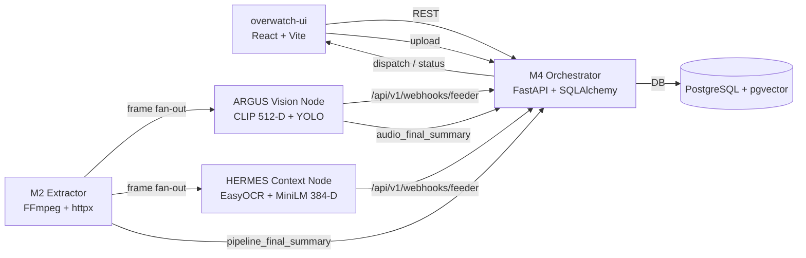
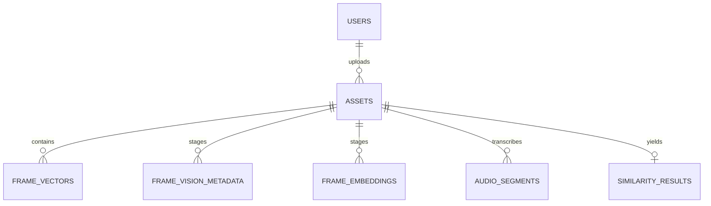

# System Architecture: SourceGraph / Overwatch (Titan Protocol)

This repo implements a distributed media-forensics pipeline (Overwatch) backed by a FastAPI control plane (SourceGraph Orchestrator) and multiple worker nodes. The architecture is led by **Tanmay Kumar (Lead Architect)** and is designed for demo-grade deployment constraints (low VRAM, async delivery, graceful degradation) while preserving an auditable evidence trail.

## 1. Objectives

- Detect suspected piracy / content reuse via multimodal similarity (visual + text + optional audio).
- Preserve explainable evidence (OCR snippets, timestamps, trace IDs, scores, verdicts).
- Support asynchronous worker delivery with idempotency and bounded buffering.
- Keep worker responsibilities narrow and deterministic; keep state in the Orchestrator.

## 2. Repository Layout (What Lives Where)

- `overwatch-ui/`: React + Vite UI (Tailwind, Framer Motion, Lucide).
- `orchestrator/backend/`: FastAPI control plane + PostgreSQL/pgvector persistence.
- `extractor/`: FastAPI ingress node (FFmpeg frame/audio extraction + broadcast).
- `ml_vision/`: FastAPI Vision node (CLIP 512-D + YOLO + Whisper audio path).
- `ml_context/`: FastAPI Context node (EasyOCR + MiniLM 384-D + conflict detection).
- `ml_auditor/`: Auditor engine assets/indexes (offline / analysis support).

## 3. System Topology

### Node Roles

| Node | Code | Primary Responsibility | Primary Output |
| --- | --- | --- | --- |
| M4 Orchestrator | `orchestrator/backend/` | State, persistence, sync, thresholds, auth, APIs | Asset lifecycle + similarity results |
| M2 Extractor (ATLAS) | `extractor/worker.py` | Download, FFmpeg normalize, broadcast frames/audio | `pipeline_final_summary` |
| Vision Node (ARGUS) | `ml_vision/main.py` | CLIP embedding + YOLO detections; Ghost audio (Whisper) | `frame_vision`, `vision_final_summary`, `audio_final_summary` |
| Context Node (HERMES) | `ml_context/main.py` | OCR + semantic text embedding; conflict checks | `frame_text`, `text_final_summary` |

## 4. Control Plane (Orchestrator) APIs

The Orchestrator is a FastAPI service with a small, explicit surface area:

- Assets (producer/golden + unified upload): `POST /api/v1/assets/upload` (`orchestrator/backend/app/controllers/golden_controller.py`)
- Search (auditor upload + similarity): `POST /api/v1/search/upload` (`orchestrator/backend/app/controllers/search_controller.py`)
- Webhooks:
  - Polymorphic feeder: `POST /api/v1/webhooks/feeder`
  - Legacy vector sink: `POST /api/v1/webhooks/vector`
  - Legacy completion: `POST /api/v1/webhooks/complete`
  (`orchestrator/backend/app/controllers/webhook_controller.py`)
- Auth:
  - OTP request/verify, Google OAuth, session: `POST /api/v1/auth/*`, `GET /api/v1/auth/me`
  (`orchestrator/backend/app/controllers/auth_controller.py`)
- Dashboard/health endpoints: `orchestrator/backend/app/controllers/feed_controller.py`

### Traceability

Every request is stamped with `X-Trace-ID` via middleware (`orchestrator/backend/app/main.py`). The same trace ID is propagated into logs and can be echoed back to clients for end-to-end debugging (UI -> Orchestrator -> worker webhook -> DB -> similarity).

## 5. Worker Contract (Feeder Payloads)

The `/api/v1/webhooks/feeder` endpoint accepts a discriminated union of events defined in:

- `orchestrator/backend/app/models/schemas.py` (`FeederPayload` with discriminator `type`)

Core event types:

- `system_ping`: liveness/services map
- `frame_vision`: per-frame CLIP vector (must be exactly 512 floats)
- `frame_text`: per-frame OCR + text vector (must be exactly 384 floats)
- `vision_final_summary`, `text_final_summary`: end-of-batch metrics
- `pipeline_final_summary`: authoritative "all frames dispatched" signal
- `audio_final_summary`: audio transcript segments + full script

### Idempotency and Ordering

- Feeder events are accepted asynchronously; the HTTP handler is intentionally non-blocking.
- Duplicate frame deliveries are handled via uniqueness keys and conflict-safe inserts.
- The Orchestrator tolerates out-of-order arrival: modalities do not need to arrive in lockstep.

## 6. Persistence Model (PostgreSQL + pgvector)

The durable evidence store lives in PostgreSQL with the `vector` extension enabled at startup. ORM models are defined in:

- `orchestrator/backend/app/models/db_models.py`

Key tables:

- `users`: passwordless accounts, OTP fields, roles.
- `assets`: one row per ingest; lifecycle state, transcript, completion locks.
- `frame_vectors`: paired embeddings (legacy similarity surface) with HNSW cosine indexes.
- `frame_vision_metadata`, `frame_embeddings`: feeder staging tables to preserve raw modality evidence.
- `audio_segments`: transcript segments.
- `similarity_results`: fused score, verdict, match pointers.

### Vector Indexing (HNSW)

`frame_vectors.visual_vector` and `frame_vectors.text_vector` are indexed using HNSW with cosine distance ops for low-latency KNN at scale. The index parameters are declared in the SQLAlchemy model.

## 7. Data Flow (End-to-End)

1. **Upload / registration**
   - Producer uploads golden content via `POST /api/v1/assets/upload`.
   - Auditor uploads suspect content via `POST /api/v1/search/upload`.
   - Orchestrator creates an `assets` row and returns the asset ID.

2. **Extraction**
   - Extractor downloads the asset and runs FFmpeg normalization:
     - frames at `1 FPS` to `224x224`
     - optional audio extraction to `16 kHz` mono WAV

3. **Fan-out**
   - Each frame is posted concurrently to Vision and Context nodes.

4. **Feeder events**
   - Nodes post `frame_vision` and `frame_text` to `POST /api/v1/webhooks/feeder`.
   - The Orchestrator validates schemas (strict vector dimensionality) and writes evidence asynchronously.

5. **Batch finalization**
   - Extractor posts `pipeline_final_summary` once all frames are dispatched.
   - Vision posts `audio_final_summary` after Whisper completes (sequenced to avoid VRAM collisions).

6. **Similarity synthesis**
   - The Orchestrator runs similarity search against protected content and persists `similarity_results`.
   - Verdicts map to `PIRACY_DETECTED`, `SUSPICIOUS`, `LOW_CONFIDENCE`, `CLEAN`.

## 8. Security Model

- Internal node calls are protected by `X-Webhook-Secret` validation in the Orchestrator.
- Authentication supports OTP and Google OAuth flows; roles are `PRODUCER` and `AUDITOR`.
- Terminal-state guards reject writes to `assets` in `failed` state (HTTP 409).

## 9. Observability and Health

- Orchestrator emits trace-linked logs for all key lifecycle events.
- Active health probing updates node liveness in the dashboard layer (`orchestrator/backend/app/main.py` + `feed_controller`).
- Workers emit periodic `system_ping` events.

## 10. Local Development Notes

- DB + Orchestrator can be started via `orchestrator/docker-compose.yml` (PostgreSQL 17 + pgvector, backend on `:8000`).
- Worker nodes are independent FastAPI services and can be run separately (see `extractor/worker.py`, `ml_vision/main.py`, `ml_context/main.py`).
- UI is the Vite app under `overwatch-ui/` and speaks to the Orchestrator APIs.

## 11. Test Harnesses

- `extractor/extractor_test.py`: loopback/testing utilities for extractor behavior.
- `orchestrator/backend/orchestrator_test.py`: loopback testing for webhook receiver behavior.

These are the recommended entry points for validating contract behavior without needing full production infrastructure.
